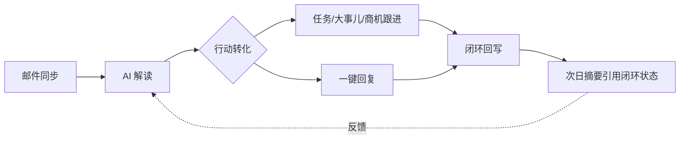

# 邮件管理整改方案：从「摘要阅读器」到「行动闭环引擎」

> 日期：2026-09-01 · 现状版本：c96a709（邮件同步 + AI 摘要 + 项目分组）

## 一句话诊断

现在的邮件管理把邮件「读懂了」，但没有「变成事」。用户看完摘要之后，所有动作（回邮件、建任务、跟风险）都发生在系统之外，价值链条断裂。

## 现状盘点（客观）

已有的好底子：
- IMAP 只读同步、凭据 AES-256-GCM 加密、按用户隔离
- DeepSeek 摘要（议题/进展/待办/风险/回复建议五段式）、规则降级
- 项目智能分组（置信度 ≥65%）、发件人公司聚合
- 企微推送链路（未启用）、每日 08:00 定时生成

价值断点（为什么"没什么用"）：

| 断点 | 表现 | 后果 |
|---|---|---|
| 摘要不可执行 | 待办/风险只是文字卡片 | 读完就忘，事项飘在系统外 |
| 只进不出 | IMAP 只读，回复建议不能发 | 还要回邮件客户端操作，多一跳 |
| 不回流 | 事项办没办完，系统不知道 | 第二天摘要还在重复同一件事 |
| 不聚集 | 邮件是邮件，项目是项目 | 项目/商机页面看不到客户往来，档案缺失 |
| 不衡量 | 摘要准不准、有没有用，无反馈 | 质量无法迭代，用户信任度流失 |
| 推送缺失 | 企微链路写好但没启用 | 被动等人来看，重要风险被淹没 |

## 整改主线：Email → Action → Loop

## 五个整改动作（按价值排序）

### P0-1 待办/风险一键转任务或大事儿 ⭐核心

- 摘要的每条待办/风险卡片增加「转任务」「转大事儿」按钮：自动带入标题（AI 提炼）、来源邮件链接、负责人（默认当前用户）、关联项目（用现有项目分组结果）
- 落库时记录 `source_email_id` 与 `source_digest_item`，任务/大事儿页面可回跳原邮件
- **闭环回写**：任务状态变为已完成时，摘要条目标记「已闭环」并划线；次日摘要不再重复推送已闭环事项
- 价值锚点：摘要从"看完就忘"变成"每天的工作起点"

### P0-2 重要邮件一键起草回复（SMTP 发信）

- 现有"回复建议"从静态文字变成可编辑草稿卡片：AI 生成草稿 → 用户修改 → 通过绑定的企业邮箱 SMTP 直接发送（复用已存的加密凭据，后端补 SMTP 通道）
- 发送失败/未配置 SMTP 时降级为"复制草稿 + 打开邮件客户端"
- 发送记录挂在原邮件会话下，形成往来线程

### P1-3 项目/商机反向挂载邮件流

- 邮件已按项目分组——把结果用出去：项目详情、商机详情增加「相关邮件」卡片区（近 30 天往来、待办未闭环数）
- 商机维度补一刀：发件人公司 = 客户时，邮件自动挂到该客户的商机时间线
- 价值锚点：谈客户、开项目会之前，一页看全往来历史

### P1-4 即时推送 + 摘要反馈

- 启用企微：风险类邮件（含"投诉/故障/赔付/违约"等信号词或 AI 判高风险）即时推送，不等次日 8 点
- 摘要底部加「有用 / 没用」一键反馈；反馈落库，用于摘要质量周报和 prompt 迭代依据
- 每日摘要推送卡片增加闭环率："昨日 5 个待办，已闭环 3"

### P2-5 价值度量面板

- 邮件管理页增加"本月价值"条：转任务数、闭环率、平均响应时长（收到 → 回复/转任务）、摘要好评率
- 管理动作的北极星：待办闭环率

## 分期

| 期 | 内容 | 预计 | 状态 |
|---|---|---|---|
| 一期（本周） | P0-1 待办/风险转任务+大事儿、闭环回写、企微启用 | 2-3 天 | ✅ 已实现（转任务/转事项/闭环回写/风险即时推送，V54） |
| 二期 | P0-2 SMTP 起草回复、P1-4 反馈与即时推送 | 2-3 天 | ✅ 已实现（SmtpMailClient + 摘要反馈 + 风险即时推送） |
| 三期 | P1-3 项目/商机邮件流、P2-5 价值面板 | 2-3 天 | ✅ 已实现（项目详情相关邮件卡片 + 本月价值条；商机维度未做） |

## 验收标准（一期）

- 摘要待办卡片点「转任务」后出现在任务管理，任务完成后摘要标记已闭环
- 次日摘要不再出现已闭环的待办
- 企微收到风险邮件即时推送与每日摘要卡片（含闭环率）
- e2e：转任务 → 完成任务 → 摘要状态回写 全链路用例

## 不做的事

- 不做完整邮件客户端（文件夹管理、星标、规则）——这不是我们的战场
- 不改同步架构与安全模型——现有的加密、隔离、降级设计保留
- 不上多邮箱聚合——先把单账号价值做穿
